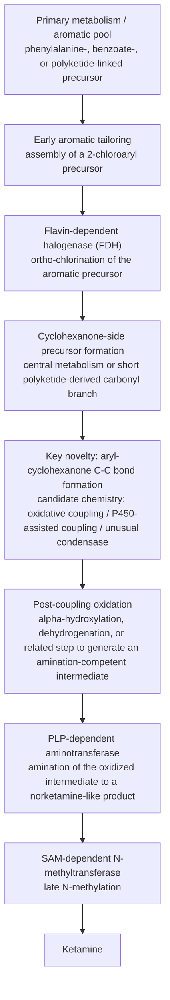

# Computational Identification of Candidate Genes for Ketamine Biosynthesis in *Pochonia chlamydosporia*

**Rev03 - mechanistic reverse-pathway update after Pc123 Ensembl remap**

> Revision basis: the draft five-gene Scaffold 14 model was re-evaluated against the Pc123 Ensembl annotation (PcB1v2) and the improved PcB1v4 assembly. The strongest grounded genomic result is a radicicol-like comparator locus on scaffold1640 / AOSW04000009.1, while ketamine-specific pathway assignment remains unresolved.

## Abstract

A 2020 study reported ketamine in bioactive fractions from cultures of the nematophagous fungus *Pochonia chlamydosporia*, motivating the hypothesis that this species may produce ketamine or a closely related chlorinated arylcyclohexylamine. Earlier drafts of the present manuscript proposed a dedicated five-gene ketamine biosynthetic cluster on Scaffold 14. Here, that proposal is revised using the public Pc123 Ensembl annotation set (PcB1v2; GCA_000411695.2) together with the improved PcB1v4 assembly (GCA_000411695.4). We reconciled draft-specific candidate identifiers with public gene models, extracted the corresponding annotated protein, CDS, and cDNA records, and mapped validated intervals from PcB1v2 to PcB1v4.

This remap did not validate the previously asserted Scaffold 14 five-gene architecture. Instead, it grounded a real secondary-metabolism locus on PcB1v2 scaffold1640 spanning 33,901 bp and containing a reducing polyketide synthase (I1G_00003782), a cytochrome P450 (I1G_00003783), a major facilitator superfamily transporter (I1G_00003785), the halogenase Rdc2 (I1G_00003787), and a non-reducing polyketide synthase (I1G_00003788). This interval maps exactly to the reverse-complement of PcB1v4 AOSW04000009.1:1,935,190-1,969,090. The locus provides sequence-grounded evidence that Pc123 encodes bona fide halogenated polyketide machinery, but it does not contain a co-localized aminotransferase or N-methyltransferase and therefore does not, by itself, establish a ketamine pathway.

The most defensible interpretation is now a hypothesis-driven, partially distributed pathway model. Aromatic chlorination is biologically plausible in *P. chlamydosporia*, but the ketamine-specific steps—especially aryl-cyclohexanone coupling and the post-coupling oxidation/amination sequence—remain unresolved. Accordingly, the experimental proposal is revised from immediate full-cluster reconstruction in *Saccharomyces cerevisiae* to a gated validation program: orthogonal compound confirmation, isotope incorporation, native genetic linkage, modular heterologous testing, and only then any larger pathway reconstruction.

## Introduction

*Pochonia chlamydosporia* is a nematophagous and endophytic fungus with a well-documented capacity for secondary metabolism, including chlorinated aromatic and polyketide chemistry. Prior literature on radicicol and related resorcylic acid lactones shows that this genus already possesses the enzymatic logic required for aromatic halogenation, paired polyketide synthases, and oxidative tailoring. That metabolic background makes the species a plausible source of unusual chlorinated metabolites, even if a ketamine pathway has not been established.

The motivating chemical evidence comes from Ferreira et al. (2020), who reported ketamine in bioactive fractions from *P. chlamydosporia* culture extracts. That report is sufficiently provocative to justify genomic follow-up, but it does not itself establish a gene-to-metabolite chain of causality. Any genomic claim of natural ketamine biosynthesis therefore requires exceptional rigor, particularly because ketamine is cataloged in major resources as a drug or ligand rather than as a known fungal natural-product biosynthetic endpoint.

The earliest drafts in this project moved too quickly from biological plausibility to a specific cluster claim. They described a five-gene ketamine biosynthetic cassette on Scaffold 14 and proposed direct heterologous reconstruction in yeast. Sequence reconciliation against the uploaded Pc123 assembly and the public Ensembl annotation does not support that formulation. This revision replaces the unsupported Scaffold 14 cluster narrative with a sequence-grounded comparator-locus result and reframes the paper as a hypothesis-driven genome-mining and experimental-prioritization study.

## Methods

### Genome resources and identifier reconciliation

Pc123 assembly GCA_000411695.2 (PcB1v2) was used as the primary coordinate system because it is the stable public annotation layer exposed through Ensembl Fungi. The following sequence resources were used for remapping: the PcB1v2 GFF3 annotation, peptide FASTA, CDS FASTA, cDNA FASTA, and genomic DNA FASTA. The PacBio-improved Pc123 assembly GCA_000411695.4 (PcB1v4) was used as the updated sequence context for cross-version validation.

Draft-specific labels such as PCH_10405, PCH_PKS7, PCH_AAT1, PCH_CYP102, and PCH_NMT1 were treated as working identifiers rather than assumed public accessions. Candidate loci were reconciled by enzyme class, annotation content, and genomic context, with priority given to explicitly annotated halogenase, PKS, and tailoring genes that co-localized in recognizable secondary-metabolism architecture.

### Sequence-grounding and cross-assembly mapping

Annotated genes in the validated PcB1v2 locus were extracted from the Ensembl GFF3 and sequence FASTA files. The full locus interval was then mapped into PcB1v4 by exact genomic sequence comparison, allowing a direct bridge between the public annotation layer and the improved assembly. Protein lengths, coding sequence lengths, strand orientations, and interval boundaries were retained as sequence-grounded features.

This revision deliberately distinguishes between analyses that were completed here and analyses that remain proposed future work. The present update includes assembly reconciliation, annotation-backed locus recovery, and draft-ID bridging. Full antiSMASH reruns, InterProScan domain calls, phylogenetic trees, and expression reanalysis remain recommended next steps rather than completed results in this revision.

## Results

### The previously asserted Scaffold 14 cluster was not sequence-grounded

Cross-checking against the uploaded Pc123 assembly showed that the earlier claim of a five-gene ketamine cluster on Scaffold 14 was not recoverable from the sequence data as provided. Subsequent use of the Ensembl annotation layer resolved the larger problem: the draft cluster formulation depended on working identifiers and inherited claims that were not yet tied to public gene models.

Once the public annotation layer was introduced, the best sequence-grounded result shifted away from Scaffold 14 and toward a different, biologically coherent locus. This is the central correction in Rev02: the paper now reports a validated comparator locus rather than an unsupported dedicated ketamine cluster.

### A real Pc123 radicicol-like comparator locus is grounded on scaffold1640

The strongest grounded locus recovered from the Pc123 Ensembl annotation spans 33,901 bp on PcB1v2 scaffold1640 (327,360-361,260). It contains a reducing PKS, a cytochrome P450, an MFS transporter, the halogenase Rdc2, and a non-reducing PKS. The interval maps exactly onto the reverse-complement of PcB1v4 AOSW04000009.1:1,935,190-1,969,090, establishing a clean bridge between the public annotation and the improved assembly.

This architecture is strongly consistent with known radicicol-like halogenated polyketide biology in *P. chlamydosporia*. It supports the general claim that Pc123 has sequence-grounded chlorinated secondary-metabolite capacity. It does not support the stronger claim that a full ketamine pathway has already been localized, because no co-localized aminotransferase or N-methyltransferase was found inside the validated interval.

### Table 1. Sequence-grounded genes in the validated Pc123 scaffold1640 comparator locus

| Gene | Description | PcB1v2 | PcB1v4 | Strand | Protein (aa) | CDS (nt) |
|---|---|---|---|---:|---:|---:|
| I1G_00003782 | reducing polyketide synthase | scaffold1640:327360-336772 | AOSW04000009.1:1959678-1969090 | - | 2794 | 8385 |
| I1G_00003783 | cytochrome P450 | scaffold1640:338852-340613 | AOSW04000009.1:1955837-1957598 | + | 523 | 1572 |
| I1G_00003784 | hypothetical protein | scaffold1640:344121-344799 | AOSW04000009.1:1951651-1952329 | + | 212 | 639 |
| I1G_00003785 | major facilitator superfamily transporter | scaffold1640:345599-347390 | AOSW04000009.1:1949060-1950851 | - | 537 | 1614 |
| I1G_00003786 | hypothetical protein | scaffold1640:348641-349663 | AOSW04000009.1:1946787-1947809 | - | 319 | 960 |
| I1G_00003787 | Rdc2 | scaffold1640:351818-353746 | AOSW04000009.1:1942704-1944632 | - | 533 | 1602 |
| I1G_00003788 | non-reducing polyketide synthase | scaffold1640:354994-361260 | AOSW04000009.1:1935190-1941456 | + | 2088 | 6267 |

### Draft-candidate reconciliation supports a distributed rather than single-cluster model

A draft-to-public bridge table was generated to prevent unsupported identifier drift. In this table, the draft halogenase, PKS, and P450 labels can be anchored to genes within the scaffold1640 locus, but the aminotransferase and N-methyltransferase candidates remain elsewhere in the genome as annotation-level comparators rather than co-localized members of the validated locus.

This result does not eliminate ketamine biosynthesis as a possibility. Instead, it narrows the strongest current genomic conclusion to the following: Pc123 contains a validated halogenated polyketide locus and separately contains plausible aminotransferase and methyltransferase families, but the ketamine-specific linkage among those components has not yet been demonstrated.

### Table 2. Revision bridge from draft identifiers to the best current grounded Pc123 loci

| Draft ID | Draft role | Current status | Best grounded Pc123 gene | Interpretation |
|---|---|---|---|---|
| PCH_10405 | cluster halogenase candidate | exact draft-to-public mapping unresolved; best grounded Pc123 cluster halogenase | I1G_00003787 | Real Pc123 radicicol-like locus has an explicit Rdc2 halogenase co-localized with paired PKSs and a P450. |
| PCH_PKS7 | putative PKS | exact draft-to-public mapping unresolved; singular PKS unsupported by real locus architecture | I1G_00003782 / I1G_00003788 | Real Pc123 radicicol-like locus contains two co-localized PKSs rather than one. |
| PCH_CYP102 | cluster P450 candidate | exact draft-to-public mapping unresolved; best grounded co-localized Pc123 P450 | I1G_00003783 | This P450 sits inside the same validated scaffold1640 locus as Rdc2 and the paired PKSs. |
| PCH_AAT1 | cluster aminotransferase candidate | no co-localized aminotransferase found in the validated scaffold1640 locus | I1G_00006707 | Best annotation-level aminotransferase hit is elsewhere in the genome, not within the PKS/Rdc2/P450 locus. |
| PCH_NMT1 | cluster N-methyltransferase candidate | no co-localized N-methyltransferase found in the validated scaffold1640 locus | I1G_00005510 | Best annotation-level N-methyltransferase-like hit is elsewhere in the genome and not obviously secondary-metabolism-clustered. |

## Discussion

The revised genomic evidence simultaneously strengthens and weakens different aspects of the original argument. It strengthens biological plausibility for chlorinated aromatic chemistry because the Pc123 annotation now grounds a real Rdc2/P450/paired-PKS locus that fits known fungal halogenated secondary-metabolism logic. It weakens the earlier claim that ketamine biosynthesis has already been localized to a dedicated five-gene cassette.

### Proposed reverse-engineered pathway model

**Figure 1.** Reverse-engineered pathway hypothesis assuming endogenous ketamine production in *Pochonia chlamydosporia*. The model places chlorination early, treats aryl-cyclohexanone bond formation as the key novelty, and shifts amination to a post-oxidation intermediate.

Assuming that *P. chlamydosporia* genuinely produces ketamine de novo, the most parsimonious biosynthetic model is a minimal-deviation pathway in which the fungus first generates a chlorinated aromatic precursor using pre-existing halogenated secondary-metabolite logic, then couples that precursor to a cyclohexanone-derived partner through a presently unknown C-C bond-forming step, plausibly oxidative and potentially P450-assisted. In this revised model, the resulting arylcyclohexanone is not aminated directly as a simple ketone. Instead, it undergoes an additional oxidation to a more amination-competent intermediate, such as an alpha-hydroxylated or alpha-dicarbonyl-like species, after which a PLP-dependent aminotransferase yields a norketamine-like amine and a SAM-dependent N-methyltransferase furnishes ketamine. This formulation preserves the strongest feature of the minimal-deviation hypothesis - that only the aryl-cyclohexanone bond-construction step is truly unusual - while moving the later transformations back onto enzyme chemistry that is already well precedented in fungal metabolism.

This framing also improves the manuscript's resistance to alternative explanations. Because ketamine is not established as a fungal natural-product endpoint in curated pathway resources, contamination, misidentification, uptake, or carryover remain serious competing explanations until isotope incorporation, stereochemical analysis, and gene-to-metabolite linkage are demonstrated.

## Revised Experimental Strategy

The original heterologous-expression plan described immediate reconstruction of a five-gene, ~32 kb Scaffold 14 cassette in *Saccharomyces cerevisiae*. That is no longer justified by the sequence-grounded evidence. The experimental program should instead proceed through explicit gates.

### Table 3. Gated validation program replacing the immediate full-cluster reconstruction plan

| Phase | Primary goal | Recommended assays | Decision criterion |
|---|---|---|---|
| I | Orthogonal compound validation in the native producer | Authentic standard matching, HRMS/MS, retention-time confirmation, chiral analysis, stable-isotope incorporation under fungus-only conditions | A reproducible ketamine-consistent signal with isotope incorporation and stereochemical characterization |
| II | Native genomic linkage | Expression comparison of scaffold1640 locus plus distributed aminotransferase/methyltransferase candidates; targeted disruption or silencing of top halogenase/coupling candidates | Loss or alteration of the ketamine-consistent signal linked to specific native genes |
| III | Late-stage and modular heterologous sufficiency tests | Express candidate aminotransferase and N-methyltransferase combinations and feed oxidized alpha-keto, norketamine-like, or related late intermediates; separately test whether the grounded Rdc2-containing locus can supply compatible chlorinated aryl precursor chemistry | Production of diagnostic late intermediates, norketamine-like products, or ketamine-consistent products in a heterologous host |
| IV | Conditional larger-scale pathway reconstruction | Only after Phases I-III support a coherent architecture: codon optimization, intron removal, staged assembly in yeast or Aspergillus | A sequence-validated pathway model with justified gene choice and interpretable reconstruction outcomes |

## Conclusion

Rev03 replaces an unsupported dedicated-cluster narrative with a sequence-grounded genomic result. Pc123 clearly encodes halogenated secondary-metabolism machinery, and the scaffold1640 / AOSW04000009.1 comparator locus provides a concrete anchor for aromatic chlorination chemistry in *P. chlamydosporia*. What remains unresolved is whether that chemistry feeds into a ketamine pathway and, if so, how the coupling, amination, and N-methylation steps are organized. The paper is therefore strongest as a rigorous hypothesis-generating manuscript paired with a staged experimental program rather than as a claim of pathway discovery.

## References

1. Ferreira SR, Machado ART, Furtado LF, et al. *Ketamine can be produced by Pochonia chlamydosporia: an old molecule and a new anthelmintic?* Parasites & Vectors. 2020;13:527. doi:10.1186/s13071-020-04402-w.
2. Lin R, Qin F, Shen B, et al. *Genome and secretome analysis of Pochonia chlamydosporia provide new insight into egg-parasitic mechanisms.* Scientific Reports. 2018;8:1123. doi:10.1038/s41598-018-19169-5.
3. Reeves CD, Hu Z, Reid R, Kealey JT. *Genes for the biosynthesis of the fungal polyketides hypothemycin from Hypomyces subiculosus and radicicol from Pochonia chlamydosporia.* Applied and Environmental Microbiology. 2008;74(16):5121-5129. doi:10.1128/AEM.00478-08.
4. Teng S, et al. *Polyketides from the fungus Pochonia chlamydosporia and their bioactivities.* Phytochemistry. 2023;213:113747. doi:10.1016/j.phytochem.2023.113747.
5. Blin K, Shaw S, Augustijn HE, et al. *antiSMASH 7.0: new and improved predictions for detection, regulation, chemical structures and visualisation.* Nucleic Acids Research. 2023;51(W1):W46-W50. doi:10.1093/nar/gkad344.
6. Ensembl Fungi. *Pochonia chlamydosporia* 123 (GCA_000411695.2; PcB1v2), release 62 species page and downloadable annotation resources.

## Supplementary note for downstream revision

- Avoid language implying that the ketamine biosynthetic genes were identified or that a unique five-gene Scaffold 14 cluster was validated.
- Prefer language stating that a grounded Pc123 halogenated-secondary-metabolism locus was identified and that ketamine-specific pathway assignment remains unresolved.
- The sequence-grounded supplementary outputs from this workflow include locus protein, CDS, and cDNA FASTA files and the exact PcB1v2-to-PcB1v4 coordinate map.
